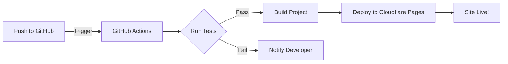

# 🌎 Free Pass Porter 🛂

Welcome to the Free Pass Porter! Your one-stop shop for figuring out where you can jet off to without the hassle of visa paperwork. ✈️


## 🚀 Features

- 🔍 Check visa requirements for multiple passports
- 🧮 Combine passports for maximum travel freedom
- 🏝️ Discover new destinations you can visit visa-free
- 🎛️ Use filters to compare passport powers

## 🛠️ Tech Stack

This project is built with some serious React superpowers:

- ⚛️ React
- 📘 TypeScript
- ⚡ Vite
- 🧹 ESLint & Prettier
- 🃏 Jest & React Testing Library

Notable tools and libraries:

- 🌍 countries-list: For country data
- 🚩 country-flag-icons: To display country flags
- 📊 papaparse: For parsing CSV data
- 🎨 react-icons: For a wide variety of icons
- 🔽 react-select: For enhanced select inputs

## 🏗️ CI/CD Pipeline

We've got a slick CI/CD pipeline set up with GitHub Actions and Cloudflare Pages:



Our pipeline ensures:

- 🧪 All tests pass
- 📊 Code coverage is at least 80%
- 🚦 Linting checks are green
- 🚀 Automatic deployment to Cloudflare Pages

## 🚀 Getting Started

1. Clone this repo
2. Run `pnpm install` to grab all the goodies
3. `pnpm dev` to start your local server
4. Visit the dev URL shown on your console and start exploring!

## 🧪 Testing

We take testing seriously around here. Run the tests with:

```bash
pnpm test
```

Remember, we need that sweet 80% coverage to keep our CI/CD pipeline happy!

## 🤝 Contributing

Got ideas? Found a bug? We're all ears! Feel free to open an issue or submit a PR.

Make sure to successfully run:

```bash
pnpm prebuild
```

This will run linting checks and ensure test coverage meets our standards.

## 📜 License

This project is licensed under the MIT License - see the [LICENSE.md](LICENSE.md) file for details.

## 🙌 Acknowledgments

- Huge thanks to [Ilya Ilyankou's passport-index-dataset](https://github.com/ilyankou/passport-index-dataset) for providing the valuable passport data that powers this application
- Shoutout to all the passport-wielding globetrotters out there
- Thanks to the amazing open-source community for the tools that made this possible

Now go forth and travel the world! 🌍🌎🌏
